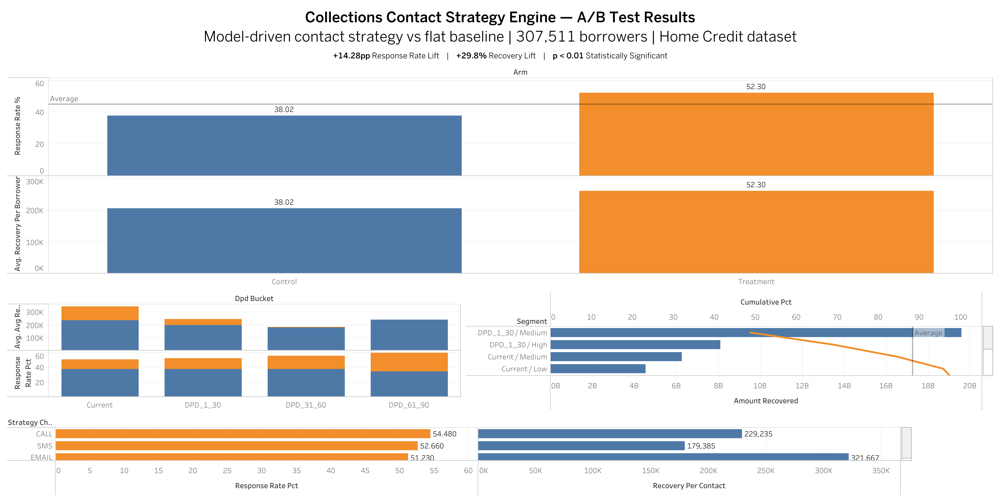

# Collections Strategy A/B Testing Engine

**Model-driven vs. flat contact strategy at 307K borrower scale.**  
A Python analytics system that operationalizes behavioral models to optimize 
debt recovery — built on the Home Credit Default Risk dataset (307,511 borrowers).

---

## Results

| Metric | Control | Treatment | Lift |
|---|---|---|---|
| Response Rate | 38.02% | 52.30% | **+14.28 pp** |
| Avg Recovery / Borrower | ~₹203K | ~₹262K | **+29.8%** |
| Incremental Recovery | — | — | **₹8.68 Billion** |
| Statistical Significance | — | — | **p < 0.01** |

Model-driven contact strategy significantly outperforms flat strategy across all metrics.

---

## The Problem

Debt collection is typically one-size-fits-all — same channel, same timing, same offer 
for every borrower. This wastes contact effort and leaves recovery on the table.

**Key question:** Can a model-driven strategy (right channel, right timing, right offer) 
produce a measurable, statistically significant lift over a flat "call everyone" approach?

---

## Experiment Design

| | Control (Arm A) | Treatment (Arm B) |
|---|---|---|
| Channel | Call (everyone) | Model-predicted preferred channel |
| Timing | 10 AM flat | Borrower-optimal window |
| Offer | Payment Reminder | DPD bucket × Risk tier matrix |
| Split | 50% stratified random | 50% stratified random |

**Validation:** Chi-square significance test · Primary metric: response rate lift

---

## Offer Logic Matrix

| DPD Bucket | Low Risk | Medium Risk | High Risk |
|---|---|---|---|
| Current | Payment Reminder | Payment Reminder | Early Intervention |
| DPD 1–30 | Payment Reminder | Settlement (5%) | Settlement (8%) |
| DPD 31–60 | Settlement (5%) | Settlement (10%) | Restructuring |
| DPD 61–90 | Settlement (12%) | Restructuring | Legal Warning + Offer (15%) |

---

## Key Findings

- **+14.28 pp response rate lift** — 52.30% vs 38.02% (p < 0.01)
- **DPD 1–30 (Medium/High Risk)** drives ~69% of total recovery — highest ROI segment
- **Email** delivers highest recovery per contact; SMS/Call drive similar response rates
- **Trade-off identified:** +27.5% recovery uplift vs −7.3% contact efficiency —  
  strategy should be tuned based on business priority (max recovery vs cost control)

---

## Design Decisions

**Rule-based offer logic over ML** — chosen for interpretability and operational 
deployability. Collections ops teams need to explain offer decisions to compliance 
and clients. Black-box models create friction.

**Stratified random split** — DPD bucket stratification ensures arm balance across 
delinquency severity, preventing Simpson's Paradox from confounding lift metrics.

**Simulated response rates derived from real attributes** — probabilities are 
deterministic from borrower data, not randomly assigned, so behavioral signal 
drives outcomes.

---

## Dashboard Preview



🔗 **[Open Live Tableau Dashboard](https://public.tableau.com/app/profile/shubham.singh7575/viz/CollectionsContactStrategyEngine/Dashboard1)**

---

## Tech Stack

`Python` · `Pandas` · `NumPy` · `SciPy` · `MySQL` · `Tableau Public`

---

## How to Run

```bash
# 1. Download application_train.csv from Kaggle → place in data/raw/
# 2. Install dependencies
pip install -r requirements.txt
# 3. Run full pipeline
python src/main.py
# 4. Load outputs/tableau_master.csv into Tableau
```

---

## Real-World Application

Mirrors how fintech lenders and collections teams:
- Optimize borrower contact strategies at scale
- Run controlled experiments on recovery workflows
- Personalize interventions using behavioral signals
- Balance recovery maximization vs operational cost

Applicable to: lending platforms, BNPL/credit products, fintech risk & recovery teams.

---

# Note: Full dataset (307K borrowers) required for numbers in README.
# Download application_train.csv from Kaggle link above.
# A 5,000-row sample is included for quick exploration.

---

*Part of a portfolio targeting analyst roles at Series A+ startups.*  
*[← Back to Profile](https://github.com/shubham1502-hue)*
